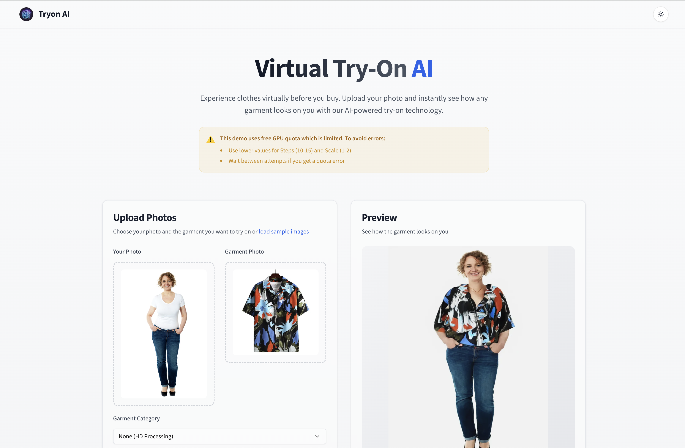

# Virtual Try-On AI

An AI-powered virtual try-on application that allows users to visualize how clothing items would look on them. Built with Next.js 15, TypeScript, and powered by the OOTDiffusion AI model.

## Features

- 🎯 Virtual try-on for various clothing categories
- 🖼️ Support for both HD and category-specific processing
- 🎨 Customizable generation parameters
- 📱 Responsive design for all devices
- 🌓 Dark/Light mode support
- ⚡ Real-time preview
- 🔄 Sample images for testing
- 💾 Easy result downloading

## Tech Stack

- **Framework**: Next.js 14 (App Router)
- **Language**: TypeScript
- **Styling**: Tailwind CSS
- **UI Components**: shadcn/ui
- **AI Model**: OOTDiffusion via Hugging Face
- **State Management**: React Hooks
- **API Integration**: Gradio Client

## Getting Started

### Prerequisites

- Node.js 18+
- npm or yarn
- A Hugging Face account and API token

### Installation

1. Clone the repository:
   bash
   git clone https://github.com/yourusername/virtual-tryon-ai.git
   cd virtual-tryon-ai

2. Install dependencies:
   bash
   npm install
   or
   yarn install

3. Create a `.env` file in the root directory:
   env
   HUGGING_FACE_TOKEN=your_token_here
   bash
   npm run dev
   or
   yarn dev

4. Open [http://localhost:3000](http://localhost:3000) in your browser.

## Usage

1. **Upload Images**:

   - Upload your photo (the model image)
   - Upload the garment you want to try on
   - Or use the "load sample images" feature

2. **Configure Settings**:

   - Select garment category (Upper-body, Lower-body, Dress)
   - Adjust generation parameters:
     - Number of samples (1-4)
     - Processing steps (recommended: 10-15)
     - Guidance scale (recommended: 1-2)
     - Random seed for reproducible results

3. **Generate & Download**:
   - Click "Generate outfit" to process
   - Download the result using the download button

## Important Notes

### GPU Quota Limitations

This demo uses Hugging Face's free GPU quota which is limited:

- Use lower values for Steps (10-15) and Scale (1-2)
- Wait between attempts if you get a quota error
- For better availability, consider:
  - Using your own Hugging Face Pro account
  - Running the model locally

### Performance Tips

- Higher step counts (>20) and scale values (>2) may:
  - Take longer to process
  - Consume more GPU quota
  - Not necessarily yield better results

## License

This project is licensed under the MIT License - see the [LICENSE](LICENSE) file for details.

## Acknowledgments

- [OOTDiffusion](https://huggingface.co/levihsu/OOTDiffusion) for the AI model
- [shadcn/ui](https://ui.shadcn.com/) for the UI components
- [Vercel](https://vercel.com) for hosting
- [Next.js](https://nextjs.org) team for the amazing framework
